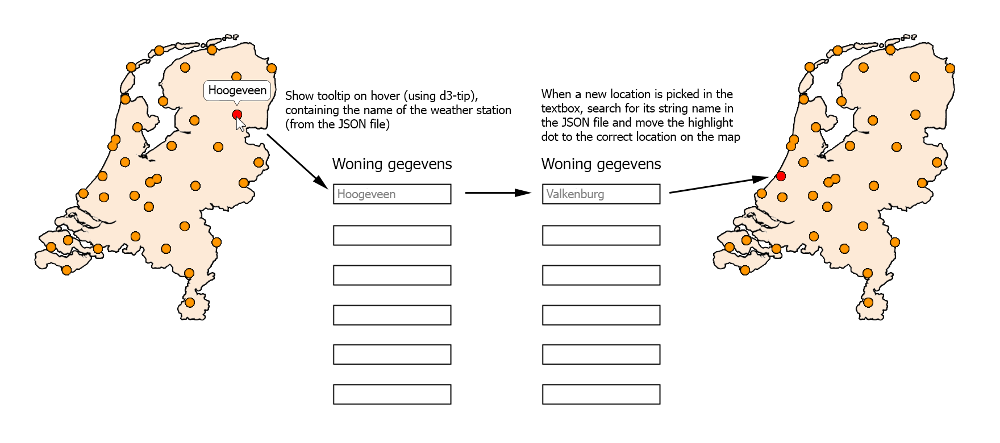
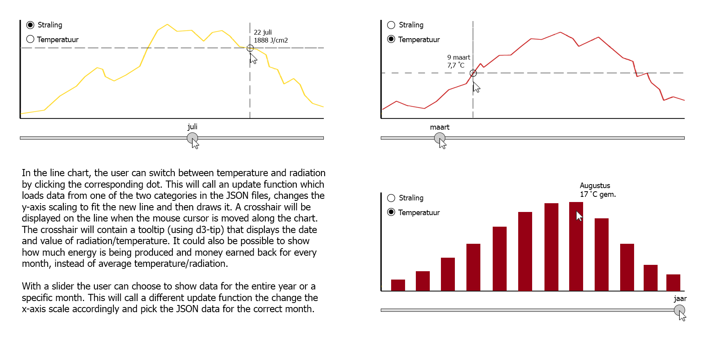
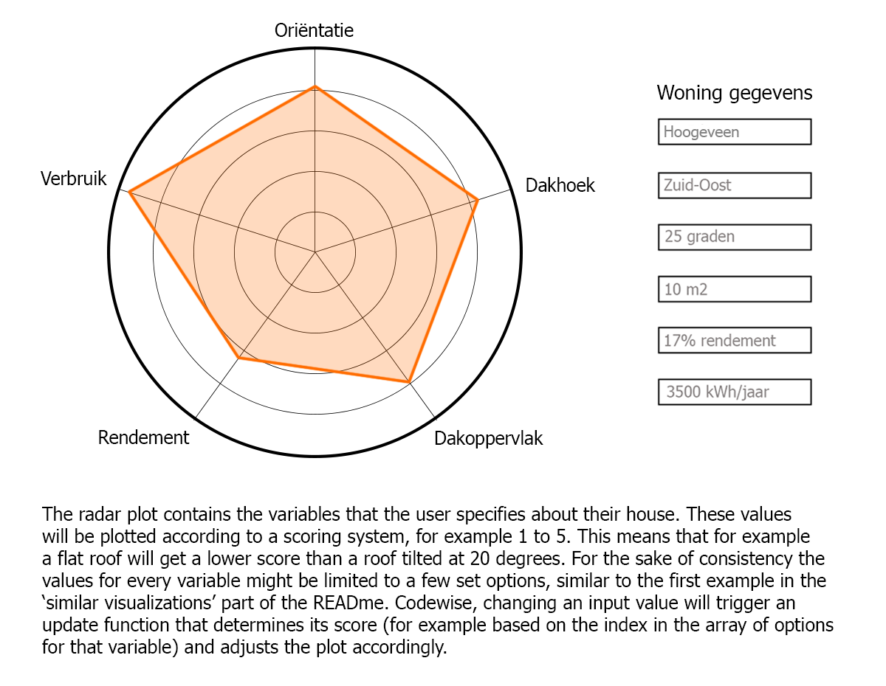
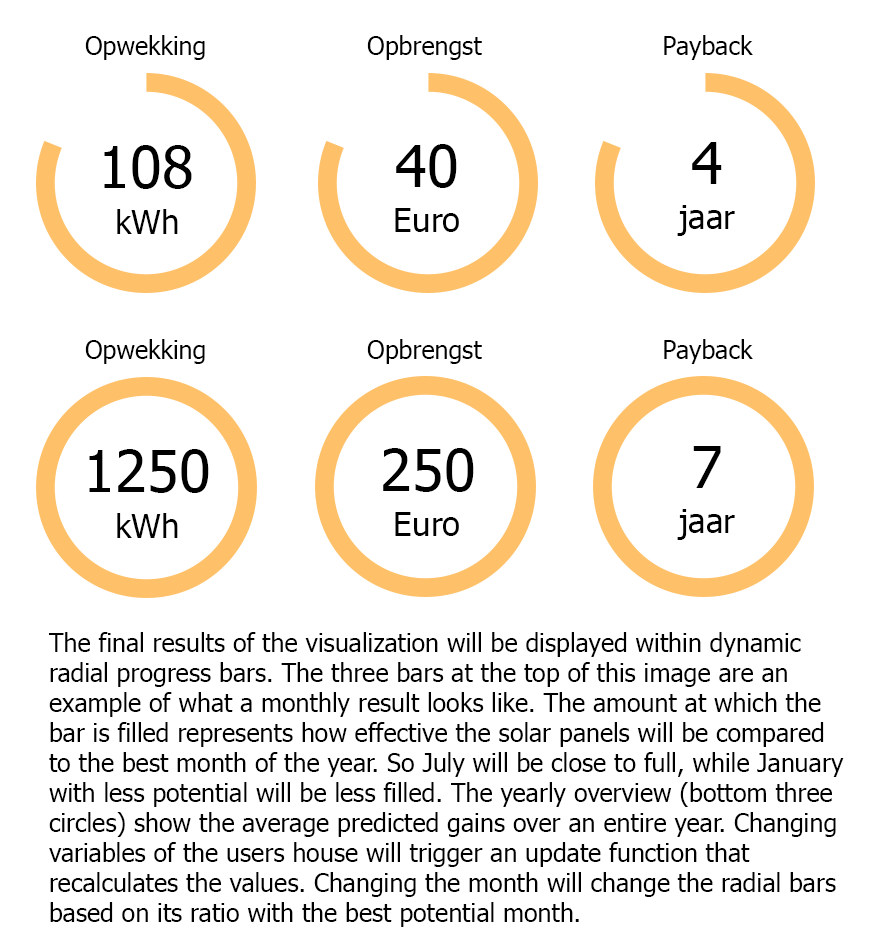

# Design Document
###### Jesse Emmelot   11963522

### Data sources
###### KNMI
http://projects.knmi.nl/klimatologie/daggegevens/selectie.cgi
- temperature for all weather stations in 2017
- radiation for all weather stations in 2017

All KNMI data is in .txt format and can be converted to JSON by running a selfmade Python file. Before conversion the excess text at the top of every data file will be trimmed, after which each data category (date, temperature etc.) gets its own JSON key name. To use the JSON data in JavaScript, categories can be called by their key name from the JSON files.

###### Solar panel data
- https://www.zonne-energiegids.nl/soorten-zonnepanelen/   Four common types of solar panel. These could easily be displayed in a dropdown menu.

- https://woonbewust.nl/blog/soorten-zonnepanelen   Also four types of solar panel, including efficiency percentage as well as pros and cons. These pros and cons could also be in a tooltip that gets displayed when a dropdown menu option is hovered over.

### Compenent overview
###### Country map

###### Chart containing lines and bars

###### Radar plot

###### Results section

### Components description
The images above contain general descriptions of how they function. This paragraph will add remaining details.
- ###### Country map
The dots representing the locations of the weather stations can be made by appending circles at the coordinates on the map, which are included in the KNMI datasets.

- ###### Chart containing lines and bars
To switch between showing temperature/radiation and energy/profit potential next to the crosshairs, an simple switch element may be added to the charts.

- ###### Radar plot
Plotting the colored lines on the radarplot can be done by connecting the five radial points of data together. 

### D3 plugins
###### d3-tip
This plugin will be used to display most text and information on hover.
- displaying name of weather stations on the map
- displaying line/bar chart values next to the crosshair
- possibly displaying months above the slider

###### datamaps
This could be used to format and style the country map.

###### d3.slider
This offers simple and effective methods to make a slider.
