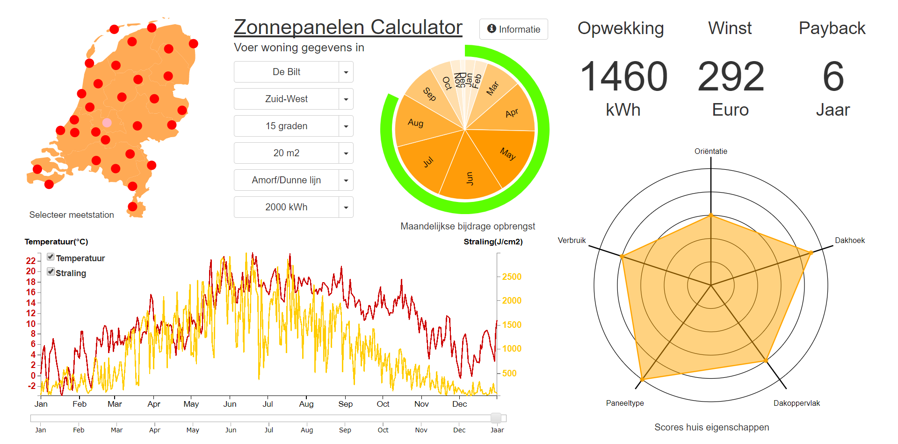

# Project report
## Personal Solar Power (Eigen zonne-energie)
###### Jesse Emmelot   11963522

### Short description
This visualization shows the user the potential gains from solar energy in their home, by having them provide information about their house and location to calculate results. These results are based on climate data from that location, and visualized along with how well the house scores in terms of solar suitability.

### Technical design
#### Overview
The datastructure of the project consists of one HTML file, one CSS file and several Javascript files. The HTML file includes all external code with script tags, so there are no local libraries inside the repository.  The Javascript files consist of a main file and a separate file for every visualization. The main file contains all global variables  and functions used within itself and other files. It also contains the dataset queue, which after being called allows for all separate visualization functions to be called and altered.

#### Detailed descriptions
##### HTML
The single HTML file houses the entire visualization. The single custom CSS file, along with external bootstrap stylesheets are included in the head. The body includes all external libraries as well as the personal javascript files. Every visualization asset is attached to its own svg of div element to avoid conflict and make for easy CSS styling.

##### Javascript
###### globals
As mentioned, there is one main Javascript file, with every separate visualization having its own file. The main file starts with instantiating the many global variables that will be used in its own functions or within other files. Between the global variables and global functions are a view anonymous functions to calculate how well each panel scores in terms of overall qualities, based on its efficiency, temperature coefficient and price.

###### update functions
Below this are the update functions for the four visualizations (radar/line/pie charts and radial progress bar).
- updateRadar: when one of its five values has changed, takes the updated value array as input to redraw the colored plot.
- updateLine: transitions the lines for temperature and radiation based on which period and weather station is selected, as well as hide or show the lines and their crosshair based on checkbox status.
- pieColors/updatePie/arcTween: pieColors is used to determine which shade each month gets based on how high its yearly contribution value  to total energy production is. updatePie redistributes every slice (using the arcTween function) when results are updated, recoloring every slice with the previously calculated values.
- updateProgress: transitions the bar to a new position along the circular track when the overall score of the house changes, recoloring it using the embedded formulas.

###### main functions
- window.onload: prepares some assets (activating information tab functionality, prechecking checkboxes) and calls datasets function
- datasets: queues json datasets to be implemented. Data.json contains all weather station related information, map.json contains data to plot the country map and months.json includes the monthly solar efficiencies (when facing south) at all pickable roof angles.
- ready: initializes datasets as variables. The values from data.json get immediately formatted afterwards.

After the ready function and formatting all weather station names are added to the bootstrap dropdown menu and checkbox functionality gets defined.  After that, all main call functions for the different visualizations are called to draw them. Slider functionality is also defined. Finally there is a response functions for every dropdown menu, to register alterations in user input and update all required elements.

###### visualization function files
- calculation.js: this is the most important file besides the main file, since it not only calculates all results, but also controls the update functions. To calculate results several functions are used:
  - dailyResults: calculates energy production and profit for any particular day of the year.
  - periodResults: combines all daily results from a particular month and the whole year.
  - scoreAngle: adjusts roof angle score based on which period is selected.
  - calculation: gets called every time a user input is altered, or the period or station is changed, to recalculate results and update every visualization. The number results are displayed at the top right of the screen. When a particular month is selected on the pie chart or slider, it shows the results for that particular month (except for payback period, which is based on yearly values). When the whole year is selected, it shows combined results from all months.
- map.js: contains main drawMap function to plot an empty map  to then place red dots on, which get their coordinates from data.json.
- line.js: contains main lineChart function to plot the initial empty line chart.
- radar.js: contains main radarChart function to plot the initial empty radar chart.
- pie.js: contains main pieChart function to plot a starter pie chart based on common monthly share distribution values.
- progress.js: contains main progressBar function to plot the bar based on the initial house score. To animate the plotting, an update and iterate function are used to draw the bar gradually (by adding a small delay after every bit of the bar). 
- slider.js: contains all code (created by … at …com) used to implement concise slider functionality in the main file.

### Decisions
Initially the idea was to create a (perhaps color-coded) map to select location, a line/bar chart to show weatherdata, a radar chart and three radial progress bars. The final version has the following changes from this initial idea:
- line/bar chart is now a lines only chart. The original plan was to have monthly progression be shown with lines, while bars would show monthly averages throughout the year. Plotting the whole year with lines instead of bars still shows the yearly fluctuations, while also allowing to hovering a specific day for data display.
- radarchart efficiency score changed to overall solar panel score. This is because temperature coëfficiënt and price are also significant factors in choosing a typeof panel.The overall panel score takes all three factors into account.
- radial progress bars reduced to one bar. This is because it was originally intented to show how much a certain month contributed to yearly gains (which a chart showing all monthly contributions together is more suited for). When ultimatelly being made to display and overall house score, having multiple ones would not be useful since they would always be identical.
- added pie chart. This is to accompany the idea of showing the monthly contribution for yearly energy production. The radial progress bar also fits well around the pie chart rather than around a result number (as was originally intented).

### Trade-offs
This visualization seeks to quickly and simply inform the user about the potential of solar power, here by also trying to make it more fun and interesting by adding the scoring system. Because of the mix of priorities from calculation, visualization and intented use simplicity the amount of input options is limited to several options per house category. Also certain values used for calculation (such as solar panel characteristics and energy prices) are common values instead of those beloning to specific supliers, therefore this project does not provide a brand level of insight. The focus lies more in sparking interest through the visualizations in combination with the numbers. 

### Ideal world
Given more time, I would add more location specification functionality, such as begin able to find the nearest weather station based on post code. I would also be able to more accurately determine the results and values for the visualizations by adding more specifics about (and types of) solar panels, to then be able to accurately visualize the differences between choosing a certain option. 
